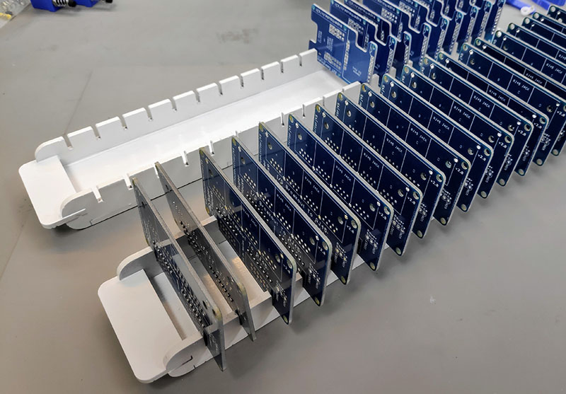
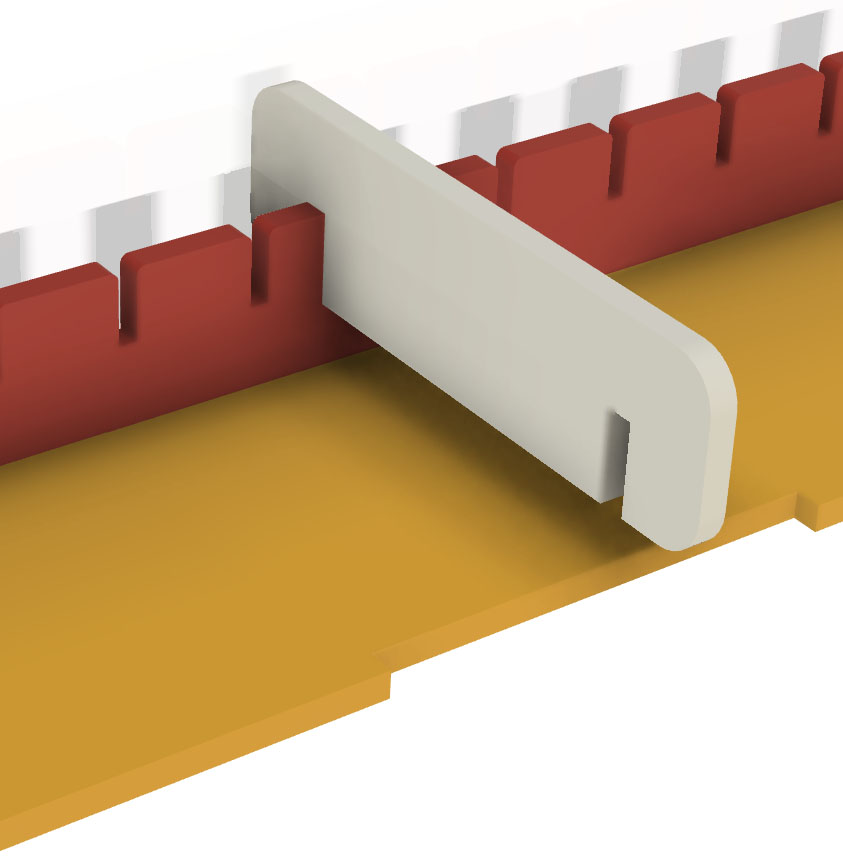

Laser-Cut PCB Tray
==================

Simple tray design that can be used to safely store PCBs vertically
during the production process.

The trays used by professional PCB assemblers are usually made from
static-dissipative material that can also withstand immersion in an
ultrasonic bath. My design isn't intended as a replacement for those,
but just as a handy way for hobbyists to keep small batches of boards
organised on the workbench or shelves.

This is much better than stacking populated PCBs on top of each other
because it saves the parts and boards being scratched or damaged.

More information: https://www.superhouse.tv/vlog-69-easy-laser-cut-pcb-tray/

The Fusion360 project includes parameters so that you can tune the
material thickness and the slot size to suit your own requirements.
There is also a parameter for board width, but it's slightly broken at
the moment: to use it, you have to first turn off all but one object
and then change the value.

DXFs have also been included for:
* 50mm wide tray with 3mm MDF and 2mm PCB slots
* 80mm wide tray with 3mm MDF and 2mm PCB slots

The side pieces are identical, but the same file has been included
twice with a different name to make it easy to match up the set of
parts.

For each tray, cut:
* 1 x base
* 2 x sides
* 2 x handles

Glue together as shown in the photo.

There is also a piece called "Assembly Jig" included in the design.
This is not part of the tray: it's to hold the sides in the correct
position while the glue is drying. Cut a few of the assembly jigs
and slide them down onto the tray without glue. This prevents the
sides from deforming. You can then either put rubber bands around
the whole assembly, or sit a weight such as a book on the assembly jigs
to keep the parts sitting flat while the glue dries:

